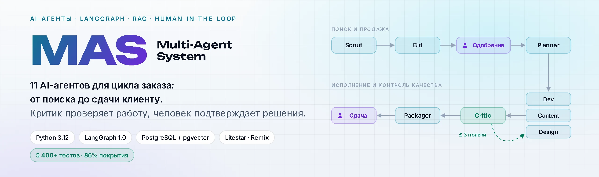
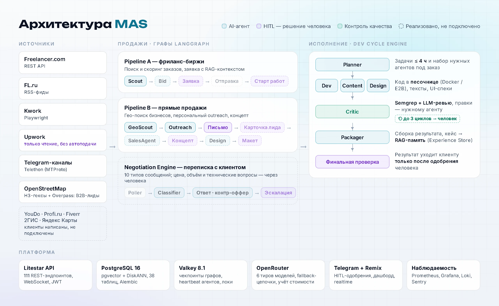
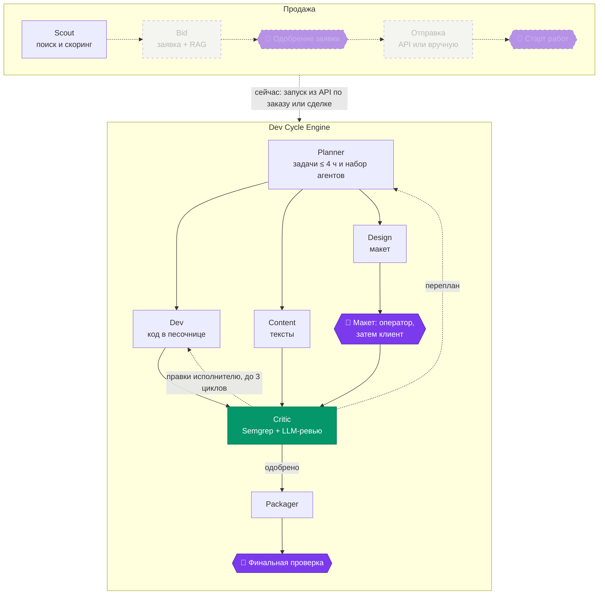
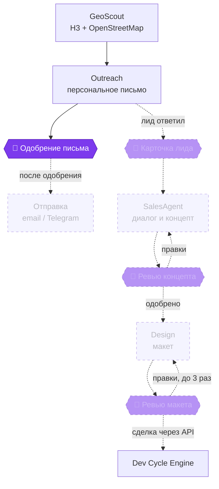
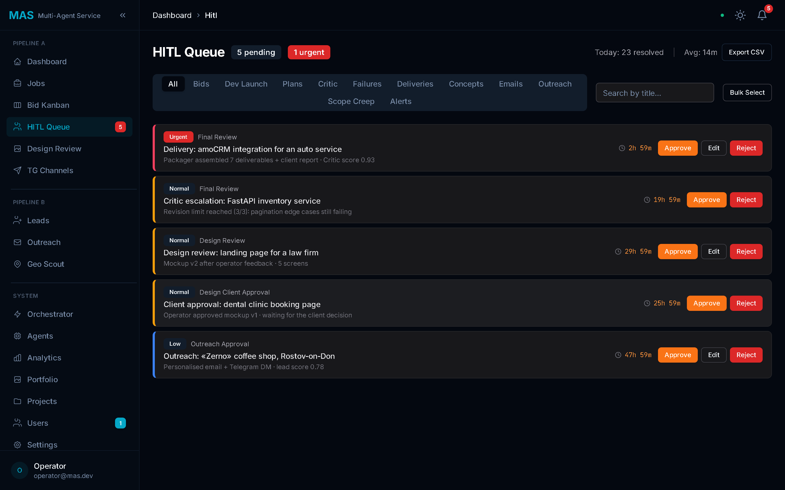
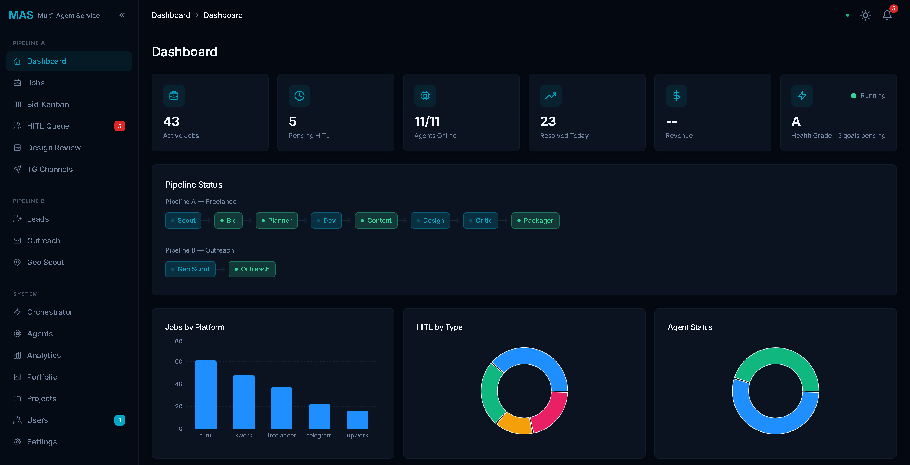
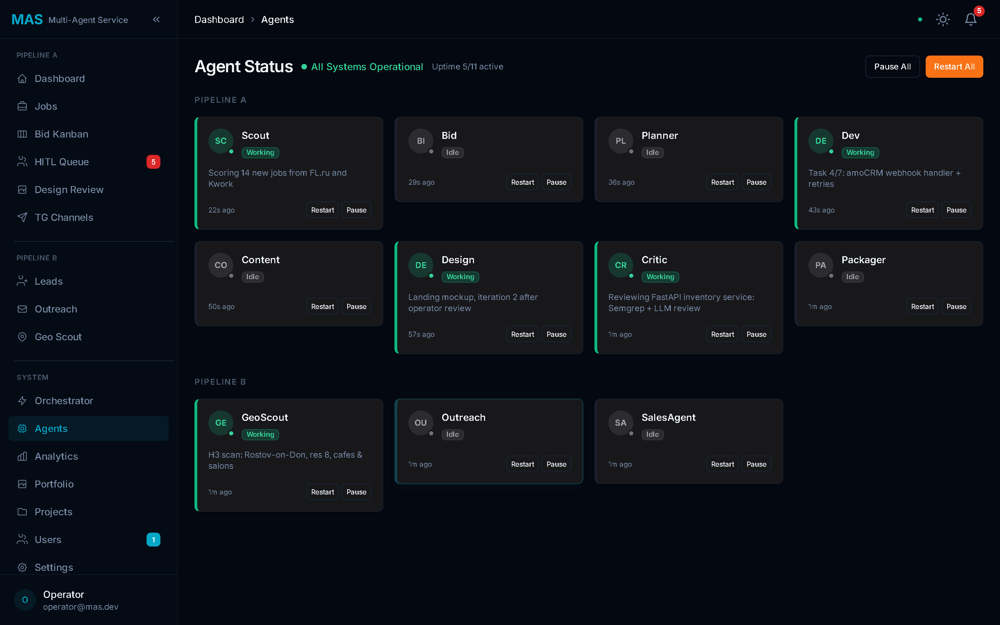

<div align="center">

<picture>
  <source media="(prefers-color-scheme: dark)" srcset="docs/assets/readme/banner-dark.webp">
  
</picture>

<br/>

**Мультиагентная AI-система для полного цикла digital-заказа: от поиска на бирже до сдачи клиенту.**<br/>
Агенты на LangGraph ищут заказы и клиентов, готовят заявки, планируют работу, пишут код и тексты, а агент-критик проверяет результат.<br/>
Ключевые решения — заявку, старт работ, письмо клиенту и сдачу результата — подтверждает человек.

<br/>


<br/>


[Задача](#задача) · [Архитектура](#архитектура) · [Пайплайны](#пайплайны) · [Агенты](#агенты) · [Контроль качества](#контроль-качества) · [Инженерные решения](#инженерные-решения) · [Интерфейс](#интерфейс) · [Запуск](#быстрый-старт) · [Статус](#статус-реализации)

</div>

---

## Коротко

| Что | Подробнее |
|---|---|
| **11 AI-агентов** | узлы графов LangGraph; ещё два (Portfolio, WebScout) написаны и покрыты тестами, но пока не подключены |
| **9 HITL-точек** | HITL (human-in-the-loop) — узел, на котором граф останавливается и ждёт решения человека: одобрение заявки, старт работ, ревью макета, финальная проверка результата и другие |
| **5 414 автотестов** | модульные, интеграционные, property-based (Hypothesis) и эталонные (golden set); покрытие кода — 86% |
| **RAG-память** | агенты находят похожие прошлые кейсы и используют их в скоринге и коде; PostgreSQL + pgvector, эмбеддинги Qwen3-Embedding-8B (3072 измерения), индекс DiskANN |
| **Источники заказов** | Freelancer.com (API), FL.ru (RSS), Kwork, Upwork (только чтение), Telegram-каналы; для прямых продаж — компании из OpenStreetMap |
| **Масштаб** | около 50 тыс. строк Python и 20 тыс. строк TypeScript в дашборде; 111 REST-эндпоинтов, 38 таблиц, 20 спецификаций |

**Статус.** В рантайме работают скаутинг, Dev Cycle Engine (планирование → исполнение → проверка → сдача с решением человека) и первая часть Pipeline B. Остальное — написанные и протестированные модули, которые ещё не связаны между собой; подробно — в [статусе реализации](#статус-реализации).

<sub>Проверено локально 24.09.2026: <code>pytest</code> без e2e — 5 414 passed, 4 skipped; покрытие — <code>pytest-cov</code> по <code>src/</code>.</sub>

## Задача

Фрилансер или небольшая студия тратит на рутину вокруг работы больше времени, чем на саму работу: мониторит биржи, пишет отклики, согласует, упаковывает результат. MAS спроектирована так, чтобы забрать этот цикл на себя и оставить человеку решения.

1. **Найти.** Scout собирает заказы с Freelancer.com, FL.ru, Kwork, Upwork и Telegram-каналов, отсеивает дубли и оценивает каждый заказ LLM-скорингом от 0 до 1.
2. **Продать.** Bid пишет заявку с опорой на похожие успешные кейсы из RAG-памяти. После одобрения заявка уходит на Freelancer.com через API, на остальные площадки её отправляют вручную.
3. **Сделать.** Planner режет заказ на задачи не длиннее 4 часов и решает, какие агенты нужны. Dev пишет код и запускает его в песочнице, Content готовит тексты, Design — UI-спецификации и макеты.
4. **Проверить.** Critic прогоняет результат через Semgrep и LLM-ревью и возвращает правки конкретному агенту. После трёх неудачных циклов решение переходит к человеку.
5. **Сдать.** Packager собирает результат и отчёт. Клиенту результат уходит только после финальной проверки человеком.

Второй контур, **Pipeline B**, ищет локальный бизнес на карте: разбивает город на H3-гексы, собирает компании из OpenStreetMap и готовит им персональные письма. Для ответивших лидов в графе есть ветка SalesAgent → концепт → макет, а согласованная сделка передаётся через API в Dev Cycle Engine — тот же цикл «сделать → проверить → сдать», что и для заказов с бирж.

Какие из этих шагов уже связаны в рантайме, а какие пока существуют как отдельные протестированные модули, — в разделе [«Статус реализации»](#статус-реализации).

## Архитектура

<picture>
  <source media="(prefers-color-scheme: dark)" srcset="docs/assets/readme/architecture-dark.webp">
  
</picture>

Каждый пайплайн — это `StateGraph` из LangGraph с условной маршрутизацией ([`src/core/graph.py`](src/core/graph.py)). Dev Cycle Engine работает с собственным чекпоинтером (Valkey + PostgreSQL): граф останавливается на HITL-узле, ждёт решения человека и продолжает с того же места, даже после перезапуска сервиса.

## Пайплайны

### Pipeline A — фриланс-биржи



<sub>Полная топология — <code>build_full_pipeline_graph()</code>. Полупрозрачные узлы реализованы и покрыты тестами, но в рантайме пока не запускаются: скаутинг работает отдельно, по расписанию, а Dev Cycle Engine стартует из API по заказу или сделке (<code>run_project_pipeline</code>, граф <code>build_planner_pipeline_graph</code> с чекпоинтером). После решения человека граф продолжается через <code>build_full_pipeline_graph</code> с тем же чекпоинтером. Пунктирные петли от Critic — правки и перепланирование, они работают.</sub>

### Pipeline B — прямые продажи



<sub>Топология соответствует <code>build_pipeline_b_graph()</code>. В рантайме цепочка доходит до карточки одобрения письма: граф запускается без чекпоинтера, поэтому после решения человека не продолжается, а флаг ответа лида пока ничто не выставляет. Сделка передаётся в разработку эндпоинтом <code>POST /api/v1/deals/{id}/start-development</code>.</sub>

## Агенты

Все агенты наследуют [`ConstrainedAgent`](src/agents/base.py): белый список инструментов, heartbeat, детектор циклов и единый контракт `_execute(state) → state`. Модели вызываются через OpenRouter по цепочке «основная → запасная → последний шанс», поэтому сбой одного провайдера не останавливает агента.

| Агент | Что делает | Модели (основная → fallback) | В рантайме |
|---|---|---|:---:|
| **Scout** | Собирает заказы, дедуплицирует, фильтрует по правилам и оценивает LLM-скорингом 0–1 | DeepSeek V3.2 → Gemini 2.5 Flash → GPT-4o-mini | ✅ |
| **Bid** | Пишет персональную заявку с релевантными кейсами из RAG-памяти | Claude Sonnet 4.6 → Gemini 2.5 Pro → GPT-4o-mini | ⏸ |
| **Planner** | Декомпозирует заказ на задачи ≤ 4 ч и выбирает последовательность агентов | Claude Opus 4.6 → Sonnet 4.6 → Haiku 4.5 | ✅ |
| **Dev** | Генерирует код, проверяет Semgrep, запускает в песочнице Docker / E2B | Claude Opus 4.6 → Sonnet 4.6 → GPT-4o-mini | ✅ |
| **Content** | Тексты, документация, переводы | Claude Sonnet 4.6 → DeepSeek V3.2 → GPT-4o-mini | ✅ |
| **Design** | UI/UX-спецификации и макеты через Pencil MCP | Claude Sonnet 4.6 → DeepSeek V3.2 → GPT-4o-mini | ✅ |
| **Critic** | Semgrep + LLM-ревью, адресные правки, эскалация к человеку | Claude Sonnet 4.6 → GPT-4o → Haiku 4.5 | ✅ |
| **Packager** | Собирает результат и отчёт, сохраняет кейс в Experience Store | DeepSeek V3.2 → Haiku 4.5 → GPT-4o-mini | ✅ |
| **GeoScout** | Сканирует город H3-гексами и собирает бизнесы из OpenStreetMap (Overpass API) | без LLM | ✅ |
| **Outreach** | Персональные письма и сообщения для лидов | Claude Sonnet 4.6 → Gemini 2.5 Pro → GPT-4o-mini | ✅ |
| **SalesAgent** | Ведёт многоходовой диалог с лидом и готовит концепт решения | Gemini 2.5 Flash (модель по умолчанию) | ⏸ |
| **Portfolio** | Адаптирует завершённые проекты под профили шести площадок | Gemini 2.5 Flash (модель по умолчанию) | ⏸ |
| **WebScout** | Ищет бизнесы по всей стране через веб-поиск (DuckDuckGo) | Gemini 2.5 Flash (модель по умолчанию) | ⏸ |

<sub>✅ — вызывается в рантайме; ⏸ — реализован и покрыт тестами, но пока не вызывается. Реестр моделей — <code>AGENT_MODEL_REGISTRY</code> в <a href="src/core/llm_client.py"><code>src/core/llm_client.py</code></a>.</sub>

## Контроль качества

LLM ошибаются, поэтому в системе четыре уровня проверки: агент-критик, решение человека, безопасное исполнение кода и тесты.

**1. Агент-критик.** [`CriticAgent`](src/agents/critic.py) проверяет работу исполнителей: код — Semgrep с тремя собственными наборами правил (опасные вызовы, доступ к файлам, сеть), весь результат — LLM-ревью. Вердикт (решение, оценка, список замечаний) определяет маршрут:

- мелкие замечания → правки конкретному агенту (`revision_target`), не больше трёх циклов;
- серьёзные → Planner перепланирует задачу;
- отказ, выход за рамки заказа или исчерпанный лимит правок → решение переходит к человеку.

**2. Human-in-the-Loop.** На HITL-узле граф останавливается и ждёт решения. Карточка приходит в Telegram-бот с inline-кнопками (Approve / Skip / Later, для дизайна — Approve / Revise / Reject) и в очередь дашборда. Правки человека сохраняются с историей «до / после».

| Точка | Когда срабатывает |
|---|---|
| Одобрение заявки | перед отправкой заявки на биржу |
| Старт работ | перед запуском Dev Cycle по выигранному заказу |
| Ревью макета | макет проверяет оператор |
| Одобрение макета клиентом | после оператора макет утверждает клиент |
| Финальная проверка | перед сдачей результата, а также при эскалации от Critic |
| Одобрение письма | перед отправкой письма лиду |
| Карточка лида | лид ответил: передавать ли его SalesAgent |
| Ревью концепта | концепт решения для лида |
| Ревью макета (Pipeline B) | макет для лида, до трёх итераций |

<sub>В рантайме сейчас срабатывают ревью и одобрение макета, финальная проверка и карточка одобрения письма; остальные точки есть в графах, но их ветки пока не запускаются.</sub>

**3. Безопасное исполнение.** Код от LLM не запускается без Semgrep-гейта. Гейт работает в режиме fail-closed: нет сканера — нет запуска. Выполнение идёт в изолированной песочнице Docker или E2B с очисткой путей. Ответы LLM разбирает [`json_repair`](src/core/json_repair.py): снимает markdown-обёртки, отрезает лишний текст, чинит висячие запятые и одинарные кавычки.

**4. Тесты.**

| Слой | Тестов | Что проверяет |
|---|---:|---|
| Unit | 5 046 | агенты с моками LLM и БД, маршрутизация графов, API, адаптеры площадок |
| Integration | 191 | сквозные прогоны графов с подменёнными узлами, API вместе с БД |
| Property-based | 112 | инварианты состояния, скоринга и переходов (Hypothesis) |
| Golden set | 69 | эталонные ответы шести агентов проходят разбор и Pydantic-схемы |
| E2E | 44 | сценарии дашборда в Playwright (нужен поднятый стек) |

<sub>Без E2E — 5 418 тестов: 5 414 проходят, 4 пропущены (skipped).</sub>

## Инженерные решения

| Задача | Решение | Где в коде |
|---|---|---|
| Процесс длится днями и ждёт человека | Собственный чекпоинтер для LangGraph: Valkey для горячих состояний (TTL 1 ч) и PostgreSQL для холодных; Dev Cycle Engine продолжает работу с HITL-узла даже после перезапуска | [`checkpoints.py`](src/core/checkpoints.py), [`graph.py`](src/core/graph.py) |
| Агент завис или зациклился | Каждый шаг агента отправляет heartbeat (интервал 90 с, таймаут 180 с, до трёх перезапусков) и проходит детектор повторяющихся шагов | [`heartbeat.py`](src/core/heartbeat.py), [`loop_detector.py`](src/core/loop_detector.py) |
| Провайдер LLM недоступен | Цепочки fallback-моделей через OpenRouter, экспоненциальный backoff, учёт токенов и стоимости каждого вызова | [`llm_client.py`](src/core/llm_client.py) |
| Upwork запрещает автоподачу | В клиенте Upwork нет метода отправки заявки: он только читает ленту заказов | [`upwork.py`](src/adapters/upwork.py) |
| Память о прошлых заказах | Experience Store: эмбеддинги Qwen3-Embedding-8B (3072) в pgvector; pgvector HNSW не индексирует больше 2000 измерений, поэтому индекс — DiskANN из pgvectorscale | [`knowledge/`](src/knowledge/), [миграция](alembic/versions/20260213_1800_migrate_embedding_768_to_3072.py) |
| Ключи площадок и доступы | Шифрование Fernet в БД, JWT с refresh-токенами, rate limiting API | [`encryption.py`](src/security/encryption.py), [`api/`](src/api/) |

> [!NOTE]
> **Находка при разработке.** LangGraph 1.0.8 читает аннотации типов у функций маршрутизации. Если параметр объявлен как `TypedDict`, состояние пересобирается по схеме, и накопленные `artifacts` теряются. Воспроизведено на минимальном примере с двумя вариантами аннотации; решение — `StateGraph(dict)` и `state: dict[str, Any]` во всех узлах и роутерах. Такие наблюдения собраны в [`.claude/rules/debugging.md`](.claude/rules/debugging.md).

## Интерфейс

**Дашборд** на Remix + shadcn/ui: очередь HITL, обзор пайплайнов, канбан заявок и проектов, заказы, лиды на карте, аналитика, состояние агентов, настройки с зашифрованными ключами площадок. Данные обновляются в реальном времени через WebSocket.



<table>
  <tr>
    <td width="50%"></td>
    <td width="50%"></td>
  </tr>
  <tr>
    <td align="center"><sub>Обзор: пайплайны, заказы по площадкам, HITL по типам</sub></td>
    <td align="center"><sub>11 агентов: статус, текущая задача, heartbeat</sub></td>
  </tr>
</table>

<sub>Скриншоты сняты с production-сборки дашборда; ответы API подменены демонстрационными данными.</sub>

**Telegram-бот** — карточки HITL с inline-кнопками, команды оркестратора, уведомления с учётом персональных настроек и тихих часов получателя.

## Стек

| Слой | Технологии |
|---|---|
| Оркестрация | LangGraph 1.0: `StateGraph`, условные рёбра, собственный чекпоинтер (Valkey + PostgreSQL) |
| LLM | OpenRouter: Claude Opus / Sonnet 4.6, Gemini 2.5, DeepSeek V3.2, GPT-4o; LangChain |
| Backend | Python 3.12, Litestar 2, SQLAlchemy 2 (async), asyncpg, Pydantic 2, APScheduler, structlog |
| Данные | PostgreSQL 16 + pgvector + pgvectorscale (DiskANN), Alembic (20 миграций), Valkey 8.1 |
| Интеграции | Playwright, httpx, Telethon, python-telegram-bot, SMTP, H3, Overpass API |
| Frontend | Remix, React, TypeScript, shadcn/ui, Tailwind CSS, TanStack Query, Zustand, Recharts, Leaflet |
| Безопасность | JWT + refresh, bcrypt, Fernet, Semgrep, gitleaks, Trivy |
| Инфраструктура | Docker, docker compose, GitHub Actions, Railway, Prometheus, Grafana, Loki, Sentry |
| Тесты | pytest, pytest-asyncio, Hypothesis, Playwright, Locust |

<details>
<summary><b>Структура репозитория</b></summary>

```text
src/
├── agents/         13 классов агентов, базовый ConstrainedAgent, Pydantic-схемы ответов
├── core/           графы LangGraph, состояние, чекпоинтер, LLM-клиент, heartbeat
├── api/            Litestar: 111 REST-эндпоинтов, WebSocket, JWT, rate limiting
├── adapters/       Freelancer, FL.ru, Kwork, Upwork, Telegram-каналы (+ YouDo, Profi.ru, Fiverr)
├── knowledge/      эмбеддинги, Experience Store, RAG-поиск
├── enrichment/     обогащение лидов, отправка email, прогрев домена, suppression list
├── geo/            H3-сканер, Overpass (OSM), клиенты Яндекс Карт и 2ГИС
├── negotiations/   переписка с клиентами: поллер, классификатор, контрпредложения, follow-up
├── bot/            Telegram-бот для HITL
├── security/       Semgrep-гейт и правила, шифрование
├── sandbox/        исполнение кода в Docker / E2B
└── …               browser, channels, notifications, worker, monitoring, cli
dashboard/          Remix + shadcn/ui
tests/              unit · integration · property · golden_set · e2e · load
docs/Full_work/     MASTER-VISION и спецификации
alembic/            миграции БД
docker/             prod-конфигурация и мониторинг (Prometheus, Grafana, Loki)
```

</details>

## Быстрый старт

Нужны Docker и ключ [OpenRouter](https://openrouter.ai).

```bash
git clone https://github.com/laminariia/multi-agent-system.git
cd multi-agent-system
cp .env.example .env            # заполнить OPENROUTER_API_KEY, JWT_SECRET_KEY, ENCRYPTION_KEY, TELEGRAM_BOT_TOKEN
docker compose up -d --build    # PostgreSQL, Valkey, API, worker, Telegram-бот, дашборд
docker compose exec api python -m src.cli.seed_data   # демо-данные: заказы, HITL-очередь, агенты
```

- дашборд — http://localhost:3000 (после seed: `admin@test.com` / `admin123`);
- API и OpenAPI-схема — http://localhost:8000/schema.

Миграции Alembic применяются при старте контейнера API. Источник «Telegram-каналы» — отдельный процесс: `python -m src.services.telegram_listener` (нужны `TELEGRAM_API_ID`, `TELEGRAM_API_HASH` и сессия Telethon).

<details>
<summary><b>Локальная разработка и тесты</b></summary>

```bash
python -m venv venv && source venv/bin/activate      # Windows: venv\Scripts\activate
pip install -e ".[dev]"
docker compose up -d postgres valkey                 # в .env: VALKEY_URL=valkey://localhost:6379
alembic upgrade head
litestar --app src.api.main:app run --reload         # API на :8000

cd dashboard && npm ci && npm run dev                # дашборд на :3000
```

```bash
pytest tests/unit tests/integration tests/property tests/golden_set   # около 5,4 тыс. тестов
pytest tests/golden_set -m golden -v                                   # только golden set
ruff check src/ tests/
```

</details>

## Документация

| Документ | О чём |
|---|---|
| [MASTER-VISION](docs/Full_work/MASTER-VISION.md) | целевая архитектура, агенты, решения по противоречиям в спецификациях |
| [Спецификация агентов](docs/Full_work/specs/agents-spec.md) | контракт и поведение каждого агента |
| [Pipeline A](docs/Full_work/pipeline-a-spec.md) · [Pipeline B](docs/Full_work/pipeline-b-spec.md) · [Dev Cycle](docs/Full_work/dev-cycle-spec.md) | пайплайны по шагам |
| [HITL](docs/Full_work/specs/hitl-spec.md) · [Тестирование](docs/Full_work/specs/testing-spec.md) · [Безопасность](docs/Full_work/specs/security-spec.md) | контроль качества, тесты, безопасность |
| [База данных](docs/Full_work/specs/database-spec.md) · [API](docs/Full_work/specs/api-spec.md) · [RAG и память](docs/Full_work/specs/rag-memory-spec.md) | данные, API, память агентов |
| [Навигация](docs/Full_work/MAS.md) | индекс всех спецификаций |

<sub>Спецификации описывают целевое состояние системы; что из этого уже работает — в разделе «Статус реализации».</sub>

## Статус реализации

**Работает в рантайме:**
- скаутинг по расписанию и из API: сбор заказов, дедупликация, LLM-скоринг, сохранение в БД;
- Dev Cycle Engine: Planner → Dev / Content / Design → Critic → Packager → финальная проверка человеком, с чекпоинтером; запускается из API по заказу или сделке;
- Pipeline B до решения человека: GeoScout → Outreach → карточка одобрения письма;
- API (111 эндпоинтов), дашборд, Telegram-бот с HITL-карточками.

**Реализовано и покрыто тестами, но ещё не подключено:**
- генерация заявки после скаутинга и отправка через Freelancer API: узлы Bid и отправки есть в графе, но граф «скаутинг → заявка» в рантайме не запускается;
- продолжение Pipeline B после решения человека: отправка одобренных писем (с дневными лимитами прогрева домена и suppression list) и ветка для ответивших лидов (карточка лида → SalesAgent → концепт → макет). Граф запускается без чекпоинтера, а флаг ответа лида пока ничто не выставляет;
- Negotiation Engine: поллер сообщений с площадок, классификатор входящих сообщений на 10 типов (четыре из них — технический вопрос, цена, контрпредложение и изменение объёма — передаются человеку), генератор ответов, обработка контрпредложений, follow-up через 2, 5 и 10 дней;
- агенты Portfolio и WebScout;
- адаптивный rate limiter площадок (адаптеры принимают его, но пока создаются без него), адаптеры YouDo, Profi.ru и Fiverr с circuit breaker, клиенты Яндекс Карт и 2ГИС;
- семантический кэш LLM: создаётся при старте API, но вызовы моделей его пока не используют;
- бюджет-трекер расходов на LLM с лимитами $50 в день и $500 в месяц;
- GDPR-модуль (удаление данных, выгрузка по запросу, согласия): контроллер пока не зарегистрирован в приложении;
- Pydantic-схемы ответов агентов: сейчас их применяют только тесты golden set.

**Известные ограничения.** CI в GitHub Actions прогоняет линтер и проверку типов, юнит-, интеграционные, golden- и E2E-тесты (Playwright), Semgrep, Trivy и gitleaks, собирает Docker-образы. Красной остаётся одна проверка, и по делу: `alembic check` находит расхождения моделей с миграциями — например, у таблицы `email_suppression_list` нет миграции. Нагрузочный тест на Locust и деплой в Railway в CI выключены и включаются переменными репозитория.

**Дальше:**
- [ ] связать скаутинг с заявкой и добавить чекпоинтер в Pipeline B — это замкнёт оба пайплайна;
- [ ] подключить Negotiation Engine, rate limiter, семантический кэш и готовые адаптеры;
- [ ] свести модели с миграциями Alembic — последняя красная проверка CI;
- [ ] измерить качество агентов на размеченных данных: точность скоринга Scout, долю правок от Critic, конверсию заявок;
- [ ] Pipeline C (сопровождение клиентов после сдачи) — пока только в спецификациях.

## Как велась разработка

- **Сначала документация.** 20 спецификаций и около 31 тыс. строк документации. [`MASTER-VISION.md`](docs/Full_work/MASTER-VISION.md) фиксирует, как разрешены противоречия между спецификациями: от числа HITL-точек до лимитов рассылки.
- **AI-assisted разработка.** Код генерировал Claude Code; моя часть — спецификации и архитектура, разбивка на этапы, настройка субагентов с зонами ответственности ([`.claude/agents`](.claude/agents)) и правил проекта ([`.claude/rules`](.claude/rules)), ревью, отладка и приёмка по тестам. Крупные этапы шли волнами параллельных агентов с разделением файлов, затем сквозными ревью. Цена скорости — модули, которые написаны и протестированы, но не подключены к рантайму; их список ведётся в разделе «Статус реализации».
- **Сверка кода со спецификациями.** [Аудит от 17 марта](docs/plans/2026-03-17-full-spec-gap-analysis.md) нашёл 58 расхождений со спецификациями, [пять сквозных ревью](docs/plans/2026-03-19-review-fixes-plan.md) — 84 замечания; по ним составлялись планы исправлений в [`docs/plans/`](docs/plans/).
- **Тесты как контракт.** Этап закрывался только при зелёном прогоне тестов. Около 150 коммитов за шесть недель, с февраля по март 2026 года.

## Контакты

**Владислав Ли** — автор проекта, разработчик AI-агентов и автоматизаций. Студент 2 курса ДГТУ, рассматриваю предложения о работе.<br/>
Telegram [@laminar1a](https://t.me/laminar1a) · vladlen691@gmail.com
