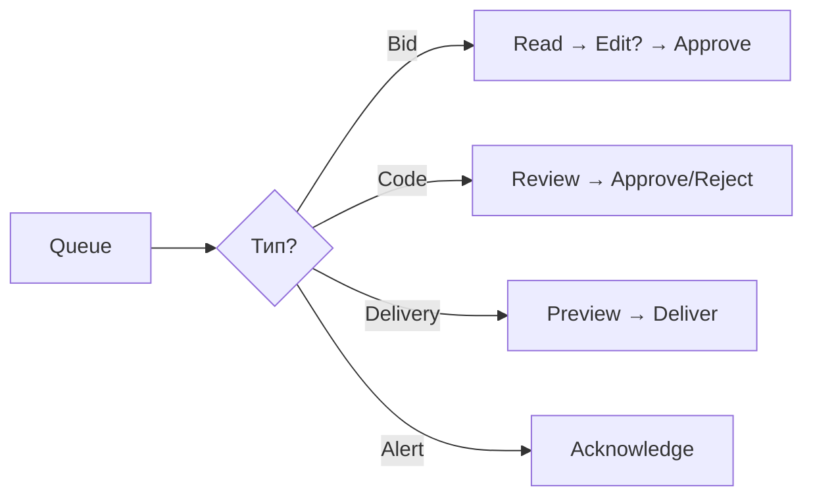

# 🧭 UX User Flows — MAS Dashboard

## 👤 Персоны

| Персона | Задачи |
|---------|--------|
| **Владелец** | HITL одобрения, мониторинг, аналитика |
| **Mobile** | Telegram для срочных HITL |

---

## 🌅 Flow 1: Утренняя рутина (10-20 мин)

```
Telegram → Dashboard KPI → HITL Queue → Projects дедлайны → ✅
```

---

## ⏳ Flow 2: HITL Approval (главный flow)



**Действия:**
- 💼 **Bid**: Approve & Send / Edit / Skip / Later
- 🔬 **Code**: Approve / Request Fixes
- 📦 **Delivery**: Deliver / Request Changes
- 🔴 **Alert**: Take Action / Acknowledge

---

## 📋 Flow 3: Projects

### Freelance (заказы с бирж)
```
Backlog → In Progress → Review → Done
```

### Цифровизация (локальные бизнесы)
```
Идеи → [+ В очередь] → В разработке → Развёрнуто
```

**Ключевое:** Кнопка **"Добавить в очередь"** на карточках в Идеях

---

## 🤖 Flow 4: Agent Monitoring

```
System Health → Найти 🟡/🔴 агента → Live Log → Restart/Debug
```

---

## 🗺️ Flow 5: Geo Outreach

```
Город → Радиус → Категории → Фильтр "без сайта" → Scan → Leads → Campaign
```

---

## 📈 Flow 6: Analytics

```
Период → KPI → Funnel анализ → Costs → ROI
```

**Ключевые метрики:** Revenue, Win Rate (>20%), Response Time (<2h)

---

## 📱 Flow 7: Mobile HITL (Telegram)

```
🔔 Push → Read card → [Approve] [Skip] [Later]
```

**Команды:** `/status`, `/pending`, `/stats`

---

## 🔄 Flow 8: Revision Handling

| Тип правки | Обработка |
|------------|-----------|
| Minor | Dev Agent auto-fix |
| Major | Planner → новый план |
| Scope Creep | 🚨 HITL → переговоры |
| Unclear | 🚨 HITL → уточнить |

---

## 📊 Частота использования

| Flow | Частота | Критичность |
|------|---------|-------------|
| HITL Approval | 5-15x/день | 🔴 High |
| Mobile HITL | По событию | 🔴 High |
| Project check | 2-3x/день | 🟡 Medium |
| Утренняя рутина | 1-2x/день | 🟢 Low |
| Agent monitoring | 1x/день | 🟢 Low |

---

## 💡 UX Рекомендации

1. **HITL Queue** — 80% времени, добавить keyboard shortcuts (A/S/E)
2. **Dashboard** — instant overview за 5 сек
3. **Telegram** — 90% HITL решений через мобильный
