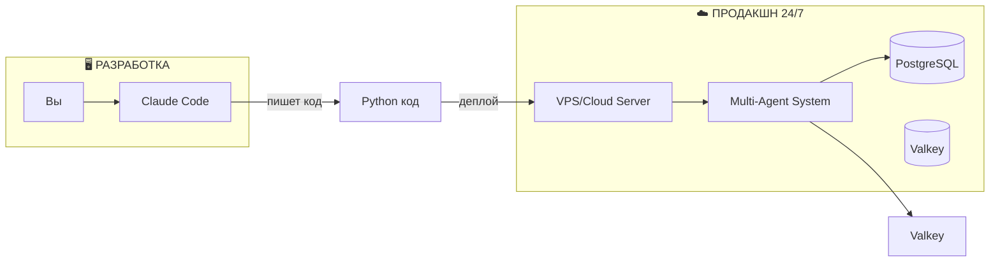
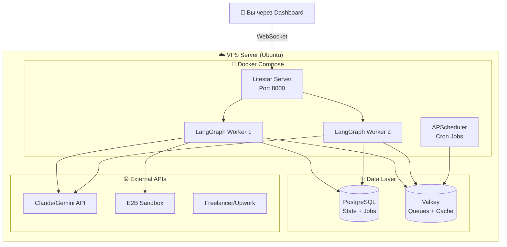
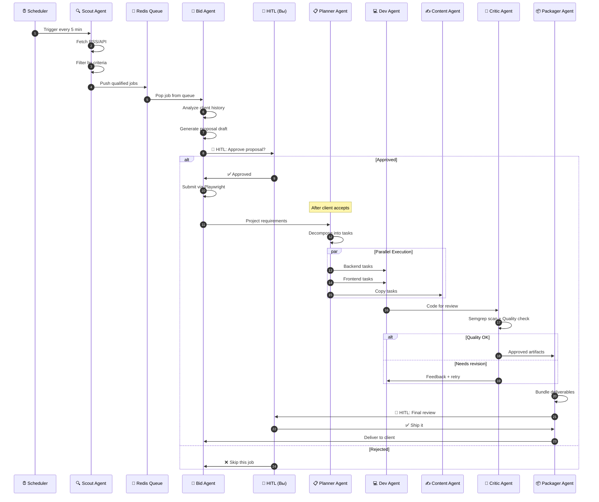
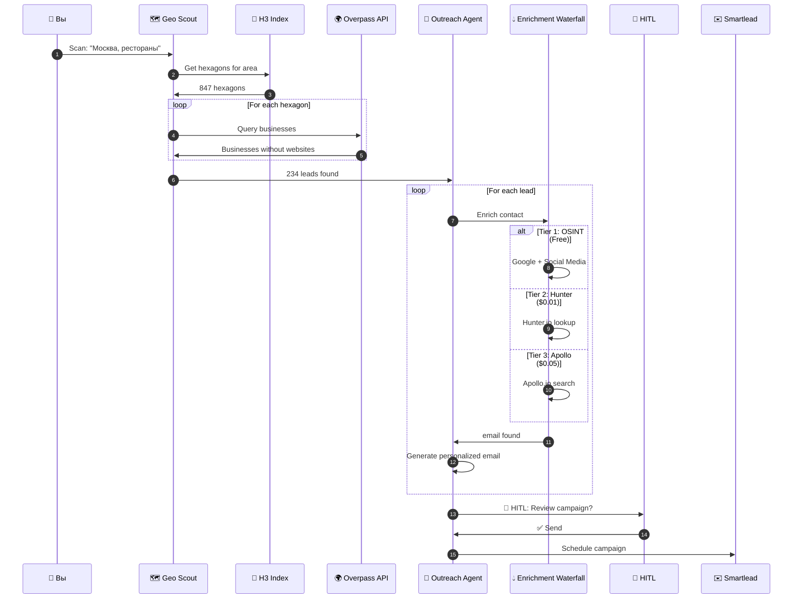
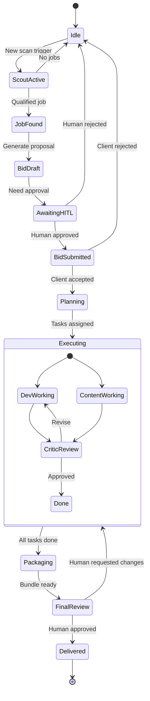
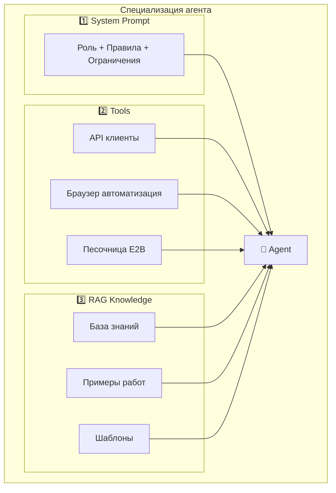
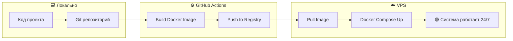
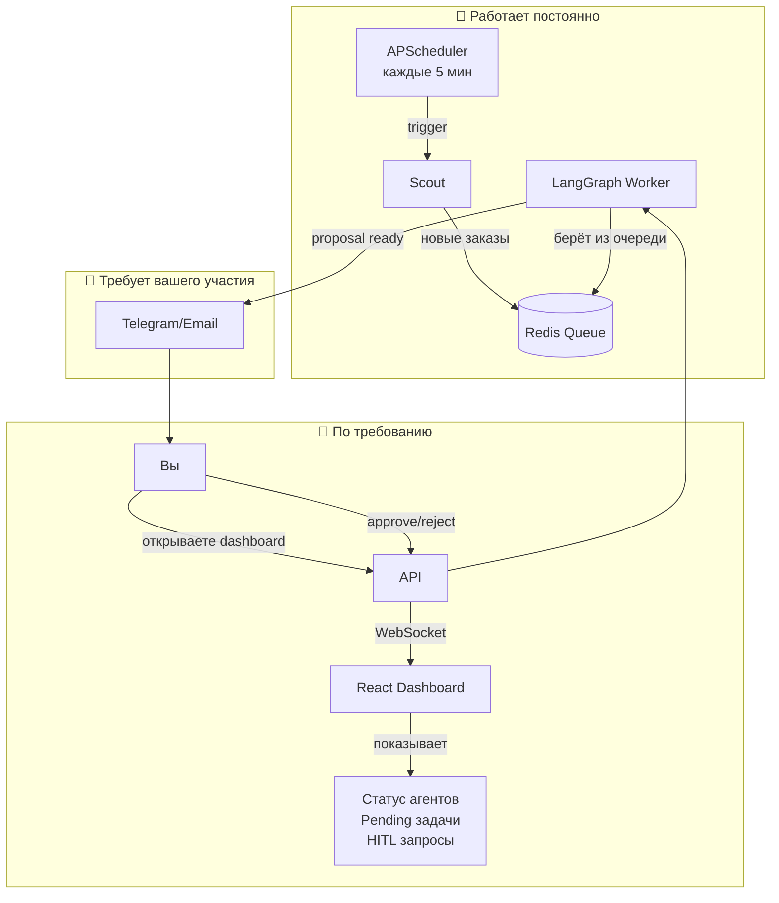

# 🔧 Technical Implementation Guide: Multi-Agent System

**Цель документа:** Объяснить КАК технически работает система и КАК её реализовать.

---

## ⚠️ ВАЖНОЕ УТОЧНЕНИЕ: Claude Code ≠ Runtime

> **Claude Code** — это инструмент для РАЗРАБОТКИ кода, НЕ для его запуска 24/7.

```
┌─────────────────────────────────────────────────────────────────┐
│                    ЧТО ТАКОЕ CLAUDE CODE                        │
├─────────────────────────────────────────────────────────────────┤
│  Claude Code (Max x20) = IDE + ИИ-ассистент                    │
│                                                                 │
│  ✅ Помогает ПИСАТЬ код                                        │
│  ✅ Отлаживает ошибки                                          │
│  ✅ Генерирует файлы проекта                                   │
│  ✅ Объясняет архитектуру                                      │
│                                                                 │
│  ❌ НЕ запускает ваш сервис 24/7                               │
│  ❌ НЕ является сервером                                       │
│  ❌ НЕ хостит ваше приложение                                  │
└─────────────────────────────────────────────────────────────────┘
```

### Правильная схема:



**Вывод:** Claude Code поможет вам НАПИСАТЬ всю систему, но запускать её нужно на отдельном сервере (VPS, AWS, DigitalOcean и т.д.).

---

## 🏗️ Техническая Архитектура

### Как работает система на сервере:



### Ключевые компоненты:

| Компонент | Технология | Зачем нужен |
|-----------|------------|-------------|
| **API Server** | Litestar + Uvicorn | Принимает запросы, WebSocket для UI |
| **Workers** | LangGraph Python | Выполняют логику агентов |
| **Scheduler** | APScheduler | Запускает Scout каждые 5 минут |
| **Database** | PostgreSQL | Хранит состояния, историю, задачи |
| **Cache** | Redis | Очереди задач, кэш, Pub/Sub |
| **LLM API** | Claude/Gemini | "Мозг" агентов |
| **Sandbox** | E2B | Безопасное выполнение кода |

---

## 📊 Диаграммы взаимодействия агентов

### Pipeline A: Фриланс (полный цикл)



### Pipeline B: Cold Outreach



### LangGraph State Machine



---

## 🧠 Как "обучить" агентов?

> **Важно:** Агенты НЕ обучаются как нейросети. Они КОНФИГУРИРУЮТСЯ через промпты, инструменты и базы знаний.

### 3 способа специализации агентов:



### Пример: System Prompt для Bid Agent

```python
BID_AGENT_PROMPT = """
# Роль
Ты — опытный фриланс-менеджер с 10-летним стажем на Upwork.
Твоя задача: писать убедительные предложения, которые выигрывают проекты.

# Правила
1. ВСЕГДА начинай с персонализации (упомяни что-то из описания клиента)
2. НИКОГДА не используй шаблонные фразы типа "Dear Sir/Madam"
3. Ограничение: максимум 300 слов на предложение
4. Обязательно включай: конкретный план работ + сроки + кейс из портфолио

# Ограничения
- НЕ обещай нереальные сроки
- НЕ занижай цену ниже $500 для веб-проектов
- НЕ соглашайся на работу без ТЗ

# Формат ответа
Верни JSON:
{
  "proposal_text": "...",
  "bid_amount": 1500,
  "estimated_days": 7,
  "relevant_case": "portfolio_item_id"
}
"""
```

### Пример: RAG Knowledge Base

```python
# knowledge/bid_agent/successful_proposals.json
{
  "proposals": [
    {
      "job_type": "landing_page",
      "client_industry": "restaurant",
      "winning_proposal": "Привет! Увидел, что вам нужен лендинг для ресторана...",
      "bid_amount": 800,
      "win_rate": 0.45
    },
    {
      "job_type": "ecommerce",
      "client_industry": "fashion",
      "winning_proposal": "Заметил, что вы ищете Shopify-разработчика...",
      "bid_amount": 2500,
      "win_rate": 0.32
    }
  ]
}
```

### Пример: Tools для Dev Agent

```python
from langchain.tools import tool

@tool
def execute_code_in_sandbox(code: str, language: str) -> dict:
    """
    Выполняет код в изолированной E2B песочнице.
    Используй для тестирования сгенерированного кода.
    
    Args:
        code: Код для выполнения
        language: python или javascript
    
    Returns:
        {"stdout": "...", "stderr": "...", "exit_code": 0}
    """
    from e2b_code_interpreter import Sandbox
    
    with Sandbox() as sandbox:
        result = sandbox.run_code(code)
        return {
            "stdout": result.logs.stdout,
            "stderr": result.logs.stderr,
            "exit_code": 0 if not result.error else 1
        }

@tool  
def search_stackoverflow(query: str) -> list:
    """
    Ищет решения на StackOverflow.
    Используй когда сталкиваешься с ошибками.
    """
    # Implementation...
    pass

DEV_AGENT_TOOLS = [execute_code_in_sandbox, search_stackoverflow]
```

---

## 🚀 Как реализовать: Пошаговый план

### Этап 1: Разработка (с Claude Code)

```bash
# Claude Code помогает создать:
multi-agent-service/
├── src/
│   ├── agents/           # Логика агентов
│   ├── core/             # LangGraph, state
│   ├── prompts/          # System prompts
│   └── api/              # FastAPI endpoints
├── knowledge/            # RAG базы знаний
├── docker-compose.yml    # Контейнеризация
└── requirements.txt
```

### Этап 2: Локальное тестирование

```bash
# Запуск локально для отладки
docker-compose up -d postgres redis
python -m src.api.main  # FastAPI на localhost:8000
```

### Этап 3: Деплой на сервер



### Минимальные требования к серверу:

| Ресурс | Минимум | Рекомендуется |
|--------|---------|---------------|
| CPU | 2 vCPU | 4 vCPU |
| RAM | 4 GB | 8 GB |
| SSD | 40 GB | 80 GB |
| OS | Ubuntu 22.04 | Ubuntu 22.04 |
| Цена | ~$20/мес | ~$40/мес |

**Рекомендуемые провайдеры:**
- Hetzner (Европа) — дёшево и надёжно
- DigitalOcean — простой UI
- AWS Lightsail — если нужна экосистема AWS

---

## 📝 Что делать в Claude Code?

### Шаг за шагом:

1. **Создать структуру проекта**
   ```
   Попросить: "Создай структуру папок для multi-agent-service"
   ```

2. **Написать базовые агенты**
   ```
   Попросить: "Напиши Scout Agent с LangGraph"
   ```

3. **Добавить промпты**
   ```
   Попросить: "Создай system prompt для Bid Agent"
   ```

4. **Настроить Docker**
   ```
   Попросить: "Создай docker-compose.yml с Postgres и Redis"
   ```

5. **Написать API**
   ```
   Попросить: "Создай FastAPI endpoints для HITL"
   ```

6. **Тестирование**
   ```
   Попросить: "Запусти тесты для Scout Agent"
   ```

---

## 🔄 Как это работает 24/7?



### Cron-расписание (APScheduler):

```python
from apscheduler.schedulers.asyncio import AsyncIOScheduler

scheduler = AsyncIOScheduler()

# Scout проверяет новые заказы каждые 5 минут
@scheduler.scheduled_job('interval', minutes=5)
async def run_scout():
    await scout_agent.scan_platforms()

# Geo Scout сканирует новый район каждый час
@scheduler.scheduled_job('interval', hours=1)
async def run_geo_scout():
    await geo_scout_agent.scan_next_region()

# Heartbeat check каждые 30 секунд
@scheduler.scheduled_job('interval', seconds=30)
async def check_heartbeats():
    await heartbeat_monitor.check_all_agents()

scheduler.start()
```

---

## ✅ Резюме

| Вопрос | Ответ |
|--------|-------|
| Claude Code запускает систему 24/7? | ❌ Нет, Claude Code только ПИШЕТ код |
| Где будет работать система? | ☁️ На VPS сервере (Hetzner, DO, AWS) |
| Как "обучить" агентов? | 📝 System prompts + 🔧 Tools + 📚 RAG |
| Что делает Claude Code? | 💻 Помогает написать весь код проекта |
| Сколько стоит сервер? | $20-40/мес за VPS |

---

**Следующий шаг:** Хотите, чтобы я начал создавать код проекта прямо сейчас?
